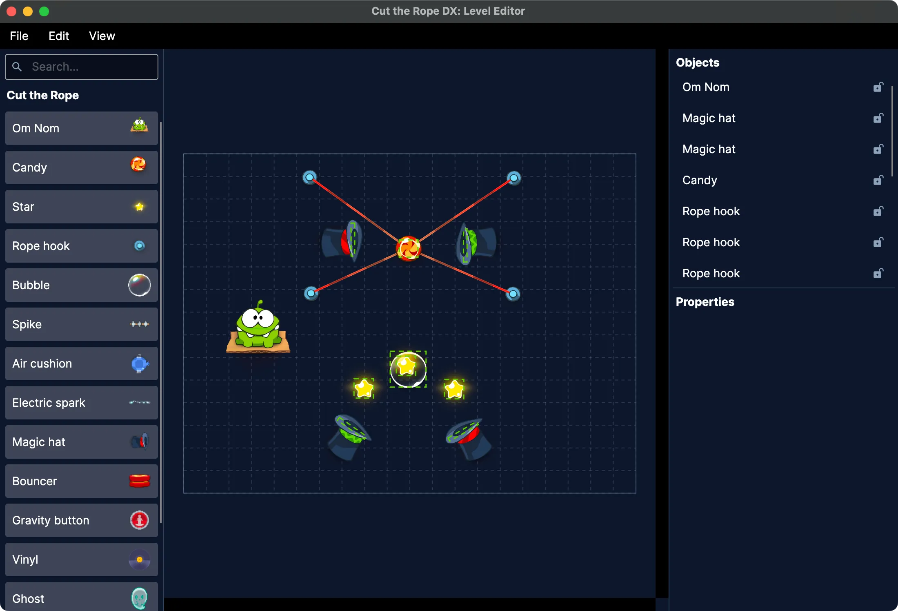

# Cut the Rope DX: Level Editor



## About

_Cut the Rope DX: Level Editor_ is a standalone app for creating and editing levels for _Cut the Rope: DX_.

Inspired by @adriandrummis's [Cut the Rope Level Editor](https://adriandrummis.github.io/CutTheRopeEditor/), it aims to be portable, lightweight, and streamlined to edit with.

This project is a part of the [_Cut the Rope Home_](https://ctrhome.github.io/fan-projects/) fan project, created by [yell0wsuit](https://github.com/yell0wsuit), with help from [contributors](https://github.com/yell0wsuit/ctrdx-editor/graphs/contributors).

> [!NOTE]
> This project is not, and will never be affiliated with or endorsed by ZeptoLab. All rights to the original game and its assets belong to ZeptoLab.

### Related projects

- [Cut the Rope: DX](https://github.com/yell0wsuit/cuttherope-dx): a fan-made enhancement of the PC version of Cut the Rope, aims to improve the original game's codebase, add new features, and enhance the overall gaming experience.
- [Cut the Rope Level Editor](https://adriandrummis.github.io/CutTheRopeEditor/): a Turbowarp-based level editor for Cut the Rope.

### Download

Coming soon.

### Features

- **Cross-platform**: runs as a native desktop app on Windows, macOS, and Linux, or directly in the browser (WebAssembly) — no install required.
- **Visual editing**: drag-and-drop object palette, a property panel for fine-tuning attributes, and a level settings dialog.
- **Full object support**: place and edit the range of _Cut the Rope: DX_ level objects — candy, ropes and grabs, bouncers, spikes, and so on.
- **Live preview**: preview object animations while you edit.
- **Level validation**: catch invalid levels before you export them.
- **Lossless XML round-trip**: unknown layers and attributes are preserved verbatim, so opening and re-saving a level never rewrites data the editor doesn't understand.
- **Editing quality of life**: keyboard shortcuts and unsaved-changes protection.

## Development & contributing

The development of _Cut the Rope DX: Level Editor_ is an ongoing process, and contributions are welcome! If you'd like to help out, please consider the following:

- **Reporting issues**: If you encounter any bugs or issues, please report them on the [GitHub Issues page](https://github.com/yell0wsuit/ctrdx-editor/issues).
- **Feature requests**: If you have ideas for new features or improvements, feel free to submit a feature request through Issues.
- **Contributing code**: If you're a developer and want to contribute code, please fork the repository and submit a pull request. Make sure to read the contribution guidelines in `CONTRIBUTING.md`.

### Building and running

The editor is an [Avalonia](https://avaloniaui.net/) app targeting .NET 10. It ships two front-ends that share the same core: **Desktop** ([src/CtrDxEditor.Desktop](src/CtrDxEditor.Desktop)) and **Browser** ([src/CtrDxEditor.Browser](src/CtrDxEditor.Browser), WebAssembly).

#### Prerequisites

1. Install the [.NET 10 SDK](https://dotnet.microsoft.com/en-us/download/dotnet/) (or higher).

2. Clone the repository:

    ```bash
    git clone https://github.com/yell0wsuit/ctrdx-editor.git
    cd ctrdx-editor
    ```

    You can also use [GitHub Desktop](https://desktop.github.com/) for ease of cloning.

3. _(Browser only)_ Install the WebAssembly build tools:

    ```bash
    dotnet workload install wasm-tools
    ```

#### Run in development

Desktop:

```bash
dotnet run --project src/CtrDxEditor.Desktop/CtrDxEditor.Desktop.csproj
```

Browser (serves the app locally in your browser):

```bash
dotnet run --project src/CtrDxEditor.Browser/CtrDxEditor.Browser.csproj
```

#### Run the tests

```bash
dotnet test
```

#### Publish a desktop build

Desktop publishes as a self-contained, native AOT single-file executable.

> Note:  
> To make `PublishAot` work, you need to follow the [AOT prerequisites](https://learn.microsoft.com/en-us/dotnet/core/deploying/native-aot/?tabs=windows%2Cnet8#prerequisites) for your OS.

a. Windows

```bash
dotnet publish src/CtrDxEditor.Desktop/CtrDxEditor.Desktop.csproj -c Release -r win-x64 -o ./publish/win-x64
```

b. macOS

```bash
dotnet publish src/CtrDxEditor.Desktop/CtrDxEditor.Desktop.csproj -c Release -r osx-arm64 -o ./publish/osx-arm64
```

> Note:  
> You can change `osx-arm64` to `osx-x64` for the Intel-based version. However, we do not guarantee it will work properly on Intel Macs.

c. Linux

```bash
dotnet publish src/CtrDxEditor.Desktop/CtrDxEditor.Desktop.csproj -c Release -r linux-x64 -o ./publish/linux-x64
```

> Warning:  
> A native AOT binary built on Linux is only guaranteed to run on the same or newer Linux distribution version.

#### Publish the browser build

```bash
dotnet publish src/CtrDxEditor.Browser/CtrDxEditor.Browser.csproj -c Release -o dist
```

The publishable static site is written to `dist/wwwroot`. This is what the [Deploy Browser to GitHub Pages](.github/workflows/deploy-pages.yml) workflow ships on every push to `main`.
